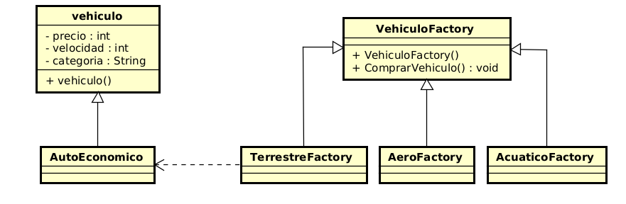

# Reino de los vehiculos

---

## Integrantes

---

- Daniel Alexander Ahumada León
- Juan Manuel Neira Zuluaga
- Juan Camilo Torres Suarez

---

### Objetivo

Nosotros implementamos un sistema dedicado a una concesionaria de vehiculos
el cual le va a permitir a los clientes poder seleccionar entre una distinta
gama de vehiculos, y que se le genere una factura con nuestro sistema.

---

### Patron de diseño

En este caso se implemento un patron de diseño creacional. Pues dentro de
la logica del sistema, el cliente va ir analizando el vehiculo que quiere comprar con las caracteristicas que quiera tener

### Patron a usar y Justificación

En este caso se escogio Factory. Pues porque lo que tenemos
es como un catalogo de vehiculos

### Como lo aplico

En este caso lo que hacemos es crear una dos clases principales. Una interfaz vehiculo y un vehiculo factory.
Y de ahi en adelante vamos creando las subclases para cada vehiculo